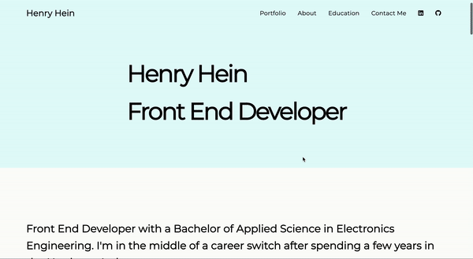

# Mobile Responsive Personal Portfolio Website v1 feat. HTML, CSS, Bootstrap, and deployed on netlify

**Live Site**: https://tender-lamport-fc95f7.netlify.app/

**Author**: **Henry** [heinhenry@protonmail.com]

Personal portfolio website that includes my social media accounts, more info about me, and portolio of projects.

## Motivation

Portolio website is an opportunity to learn about creating beautiful front-end and Mobile Responsive UI using HTML, CSS, and Bootstrap. Additionally, it was a chance to learn how to manage versions using Git.

## Technology

    

* **HTML5**: Markup language for front-end UI development
* **CSS**: Style sheet language for presentation of front-end UI development
* **Bootstrap**: Mobile first front-end CSS Framework
* **Netlify**: Cloud based hosting this website
* **Git**: Version control software for continous integration and deployment

## Features

### Mobile Responsive Design

